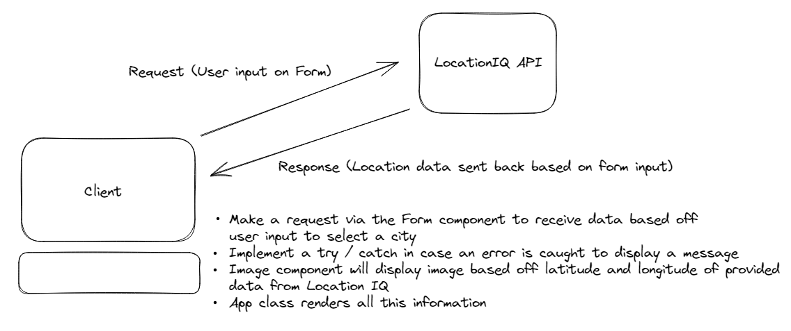

# **Author**: Reece Renninger

**Version**: 1.0.0 (increment the patch/fix version number if you make more commits past your first submission)

## Overview
<!-- Provide a high level overview of what this application is and why you are building it, beyond the fact that it's an assignment for this class. (i.e. What's your problem domain?) -->
This application will allow for users to input a city name and gain access to a map image, longitude, and latitude.  This was developed with the intention of allowing users to view different parts of the world based off their own input.  This could be expanded to allow for more in depth searching and possibly even allow live feeds if the API information was changed in the future.  

## Getting Started
<!-- What are the steps that a user must take in order to build this app on their own machine and get it running? -->
Recreating this website would require you to generate a project through React in your terminal. From there I would install your Bootstrap and Axios access to have them in your package.json.  After that you need to acquire a token from Location IQ to have access to their API.  From there you can customize your project as you see fit using components from Bootstrap.  This website is deployed through Netlify.  

## Architecture
<!-- Provide a detailed description of the application design. What technologies (languages, libraries, etc) you're using, and any other relevant design information. -->

- React was utilized to set up the webpage
- Being deployed through Netlify
- Bootstrap is being imported for design purposes
- Using LocationIQ to pull city data
- Axios is being used to connect to API(s)

## Change Log

### Feature One: Connection to LocationIQ and ability to render map

Estimate of time needed to complete: 120 minutes(~2 hours)

Start time: 12:45

Finish time: 14:51

Actual time needed to complete: 126 minutes

### Feature Two: API Calls to Backend and sending API information to my built server

Estimate of time needed to complete: 120 to 180 minutes (~2 to 3 hours)

Start time: 12:30

Finish time: 17:30

Actual time needed to complete: 5 hours

03/20/2023 14:23 - Application is now fully connecting to LocationIQ to get city information and display lat, lon, and image.
03/22/2023 17:30 - Application now has fully functional backend server that is requesting from two separate APIs for movie and weather data. Elements are designed with boot strap components to allow for better visuals and accessibility.
<!-- Use this area to document the iterative changes made to your application as each feature is successfully implemented. Use time stamps. Here's an example:

01-01-2001 4:59pm - Application now has a fully-functional express server, with a GET route for the location resource. -->

## Credit and Collaborations

- Audrey Patterson, the spirit guide of class 301d97.
<!-- Give credit (and a link) to other people or resources that helped you build this application. -->
